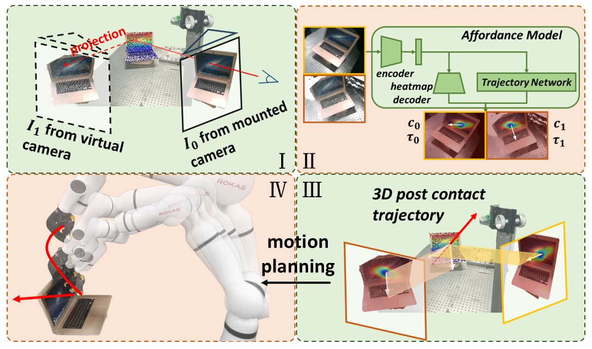
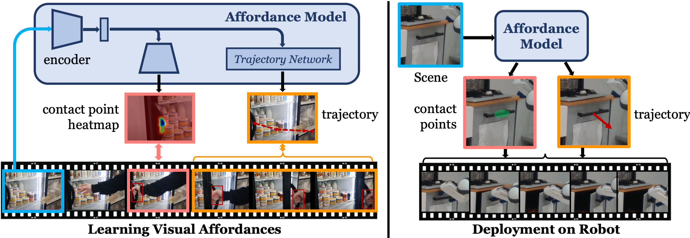

# Interactive Perception Module
We migrate [vrb](https://arxiv.org/abs/2304.08488) to our interactive perception module and use pixel warping methond to acquire 3D affordance.
<p float="left">
  
</p>

## VRB: Affordances from Human Videos as a Versatile Representation for Robotics
### Introduction
Given a scene,model (**VRB**) learns actionable representations for robot learning. VRB predicts contact points and a post-contact trajectory learned from human videos. We aim to seamlessly integrate VRB with robotic manipulation, across 4 real world environments, over 10 different tasks, and 2 robotic platforms operating in the wild.

The model takes a human-agnostic frame as input. The contact head outputs a contact heatmap (left) and the trajectory transformer predicts wrist waypoints (orange). This output can be directly used at inference time (with sparse 3D information, such as depth, and robot kinematics).

<p float="left">
  
</p>

### Installation
This code uses `python>=3.9`, and `pytorch>=2.0`, which can be installed by running the following:   

First create the conda environment: 

```
conda env create -f environment.yml
```

Install required libraries: 

```
conda activate vrb
pip install -r requirements.txt
pip install -U git+https://github.com/luca-medeiros/lang-segment-anything.git
```

Either download the [model weights](https://drive.google.com/file/d/1nzahuDh4Wa0SXCPwpu9Z_MwkQGerGAhp/view?usp=sharing) and place in `models` folders or run: 

```
mkdir models
bash download_model.sh
```
